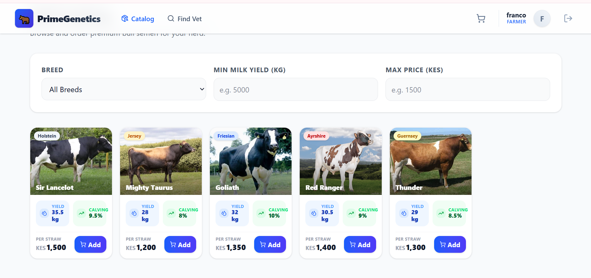
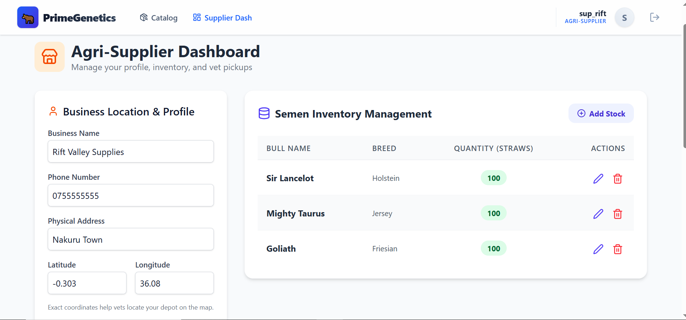
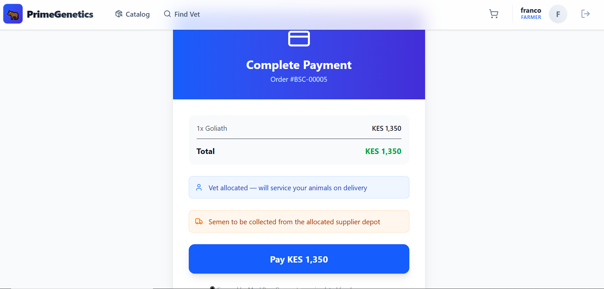

# 🐄 PrimeGenetics: Bull Semen Catalog

**A role-based marketplace where dairy farmers discover bull genetics, book a nearby vet for artificial insemination, and pay via M-Pesa.**

🔗 **Live demo:** https://digital-bull-catalog-amber.vercel.app/
⚙️ **API:** https://bull-catalog.onrender.com/
🎥 **2-min walkthrough:** [add link]
💻 **Repo:** https://github.com/Ka-few/Bull-Semen-Catalog


> ⏳ The API runs on a free tier, so the first request can take 30–60 seconds to wake up.

## The problem
Smallholder dairy farmers often struggle to find quality genetics, a reliable
AI vet, and a simple way to pay for both. PrimeGenetics brings the three steps
into one flow, built by a former dairy farmer who lived the problem.

## What it does
- **Farmers** browse and filter bulls, manage a cart, place orders, and pay with M-Pesa (Daraja STK Push, sandbox).
- **Vets** maintain profiles, get verified by admins, and see their assigned orders.
- **Agri-suppliers** manage profiles and bull inventory.
- **Admins** manage the bull catalog and verify vets.
- **Location-aware results** (React Leaflet + OpenStreetMap) help farmers find nearby vets and suppliers.

## Try it
| Role | Email | Password |
|---|---|---|
| Farmer | [demo email] | [demo password] |
| Vet | [demo email] | [demo password] |
| Admin | [demo email] | [demo password] |

## Architecture
```
React + TypeScript + Vite
          │ HTTP / Bearer token
          ▼
Node.js + Express API ──── Safaricom Daraja (M-Pesa)
          │ @supabase/supabase-js
          ▼
Supabase Auth ── PostgreSQL + RLS ── Storage
```
Supabase Auth owns passwords and sessions. PostgreSQL stores profiles, catalog,
carts, orders, and inventory. **Row Level Security** scopes every query to the
authenticated user's role, so a farmer can never read a vet's or supplier's data.

## Tech stack
| Layer | Tools |
|---|---|
| Frontend | React, TypeScript, Vite, Tailwind CSS, Axios, React Router, React Leaflet (Vercel) |
| Backend | Node.js, Express (Render) |
| Data & auth | Supabase: Auth, PostgreSQL, RLS, Storage |
| Integrations | Safaricom Daraja API, OpenStreetMap |

## Run it locally
```bash
git clone https://github.com/Ka-few/Bull-Semen-Catalog
cd Bull-Semen-Catalog

# Backend
cd backend && npm install
cp .env.example .env     # add your keys
npm run dev

# Frontend
cd ../frontend && npm install
npm run dev
```
**Backend env:** `SUPABASE_URL`, `SUPABASE_SERVICE_KEY`, `DARAJA_CONSUMER_KEY`,
`DARAJA_CONSUMER_SECRET`, `DARAJA_SHORTCODE`, `DARAJA_PASSKEY`, `DARAJA_CALLBACK_URL`
**Frontend env:** `VITE_API_URL`, `VITE_SUPABASE_URL`, `VITE_SUPABASE_ANON_KEY`

## Challenges I solved
- [e.g. handling the Daraja callback and matching it to the right order]
- [e.g. designing RLS policies for four roles]

## Roadmap
- [ ] Live M-Pesa payments (currently sandbox)
- [ ] SMS notifications for vets and farmers
- [ ] Vet ratings and reviews

## Author
**[Your name]**: full-stack developer and former dairy farmer.
[LinkedIn] · [Email]


**Live demo:** https://digital-bull-catalog-amber.vercel.app/ · **API:** https://bull-catalog.onrender.com/ · **Repository:** https://github.com/Ka-few/Bull-Semen-Catalog


## What it does

- Farmers browse and filter bulls, manage a cart, place orders, and complete demo payments.
- Vets maintain profiles, are verified by admins, and see assigned orders.
- Agri-suppliers manage profiles and bull inventory.
- Admins manage the bull catalog and vet verification.
- Location-aware vet and supplier results help farmers choose nearby providers.

## Architecture

```text
React + TypeScript + Vite
          │ HTTP / Bearer token
          ▼
Node.js + Express API
          │ @supabase/supabase-js
          ▼
Supabase Auth ── PostgreSQL + RLS ── Storage
```

The frontend lives in `frontend/`; the Express API lives in `backend/`. Supabase Auth owns passwords and sessions. PostgreSQL stores application profiles, catalog, carts, orders, and inventory. Row Level Security scopes data to the authenticated user and role.

## Stack

Repository: [link here] (https://github.com/Ka-few/Bull-Semen-Catalog)
Deployed API: [live API URL] (https://bull-semen-catalog-2.onrender.com/bulls)


- Frontend: React, TypeScript, Vite, Tailwind CSS, Axios, React Router, React Leaflet
- Backend: Node.js, Express, Supabase JavaScript client
- Platform: Supabase Auth, PostgreSQL, Row Level Security, Storage

## Screenshots

The main farmer catalog, supplier dashboard, and payment flow.

| Catalog | Role dashboard | Checkout |
| --- | --- | --- |
|  |  |  |

## Local setup

Prerequisites: Node.js 18+ and a Supabase project.

1. Create `backend/.env` from `backend/.env.example` and add your project credentials:

   ```env
   PORT=5000
   SUPABASE_URL=https://your-project.supabase.co
   SUPABASE_PUBLISHABLE_KEY=your_publishable_key
   SUPABASE_SECRET_KEY=your_server_secret_key
   ```

   Never expose `SUPABASE_SECRET_KEY` to the browser or commit it.

2. In the Supabase SQL Editor, run the migrations in order:

   ```text
   supabase/migrations/001_initial_schema.sql
   supabase/migrations/002_payment_rpc.sql
   supabase/seed.sql
   ```

3. Install and run the API:

   ```bash
   cd backend
   npm install
   npm run dev
   ```

   The API listens on `http://localhost:5000`.

4. In a second terminal, run the frontend:

   ```bash
   cd frontend
   npm install
   npm run dev
   ```

   Open `http://localhost:5173`.

## Demo accounts

After applying the schema and catalog seed, run `node scripts/seed-supabase.js` from the repository root to provision these development-only accounts:

| Role | Username | Password |
| --- | --- | --- |
| Admin | `admin` | `securepassword` |
| Vet | `vet_john` | `password123` |
| Supplier | `sup_agro` | `password123` |

Do not use these credentials in production. Rotate or remove them before deployment.

## Database migration

The project includes a SQLite-to-Supabase migration path:

- `scripts/export-sqlite-to-json.js` exports the legacy database.
- `scripts/migrate-json-to-supabase.js` creates Auth users and remaps profiles, carts, inventory, orders, and items.
- `docs/SUPABASE_MIGRATION.md` documents the schema, RLS design, Storage buckets, rollback plan, and deployment checklist.

## Project structure

```text
backend/                 Express API, controllers, auth middleware
frontend/                React application
supabase/migrations/     PostgreSQL schema and RPC migrations
supabase/seed.sql        Demo bull catalog
scripts/                 One-time seed/export/import utilities
docs/                    Migration and deployment documentation
```

## License

MIT
